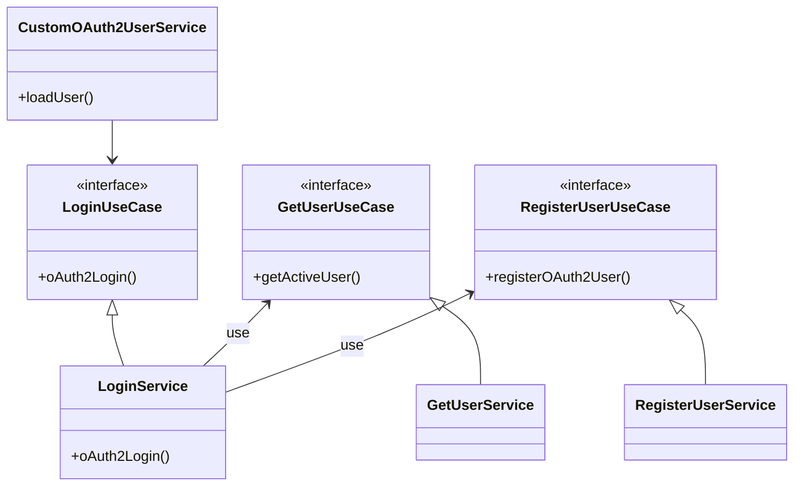

# 클래스 다이어그램

## 1. 인증

- `Auth` → `User` 방향으로 단방향 참조하며, 그 반대는 존재하지 않는다.
- `Auth` 유스케이스가 `User` 유스케이스를 직접 참조하며 아래 방향으로 참조하지 않는다.

```mermaid
classDiagram
%%    Auth
    CustomOAuth2UserService --> LoginUseCase
    LoginUseCase <|-- LoginService
    GetUserUseCase <-- LoginService: use
    RegisterUserUseCase <-- LoginService: use
%%    User
    GetUserUseCase <|-- GetUserService
    RegisterUserUseCase <|-- RegisterUserService

    class CustomOAuth2UserService {
        +loadUser()
    }
    class LoginUseCase {
        <<interface>>
        +oAuth2Login()
    }

    class LoginService {
        +oAuth2Login()
    }

    class GetUserUseCase {
        <<interface>>
        +getActiveUser()
    }

    class RegisterUserUseCase {
        <<interface>>
        +registerOAuth2User()
    }
```
