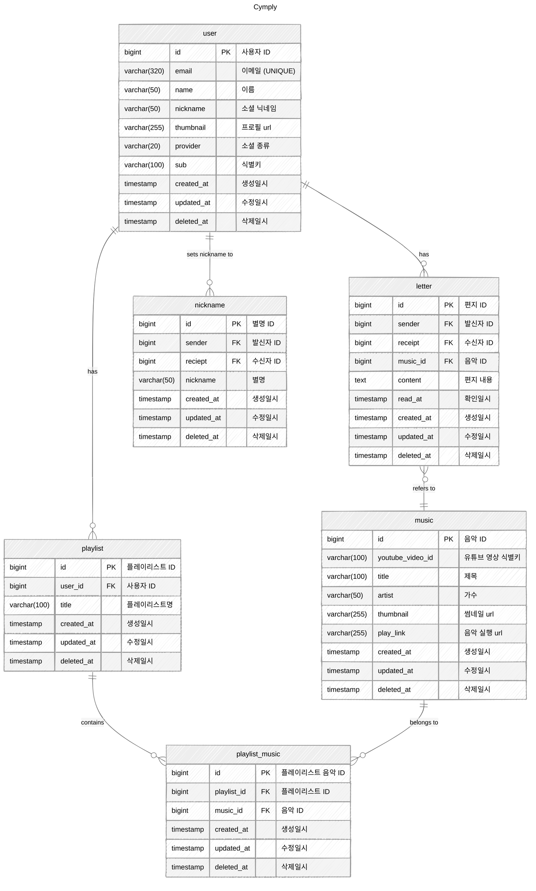

```mermaid
---
title: Cymply
config:
    look: handDrawn
    theme: neutral
---
erDiagram

    user ||--o{ letter : "has"
    user ||--o{ nickname : "sets nickname to"
    user ||--o{ playlist : "has"
    
    letter }o--|| music : "refers to"

    playlist ||--o{ playlist_music : "contains"
    music ||--o{ playlist_music : "belongs to"

    user {
        bigint id PK "사용자 ID"
        varchar(320) email "이메일 (UNIQUE)"
        varchar(50) name "이름"
        %%gender "성별"
        %%birthday "생일"
        %%birthyear "출생연도"
        varchar(50) nickname "소셜 닉네임"
        varchar(255) thumbnail "프로필 url"
        varchar(20) provider "소셜 종류"
        varchar(100) sub "식별키"
        timestamp created_at "생성일시"
        timestamp updated_at "수정일시"
        timestamp deleted_at "삭제일시"
    }

    nickname {
        bigint id PK "별명 ID"
        bigint sender FK "발신자 ID"
        bigint reciept FK "수신자 ID"
        varchar(50) nickname "별명"
        timestamp created_at "생성일시"
        timestamp updated_at "수정일시"
        timestamp deleted_at "삭제일시"
    }

    letter {
        bigint id PK "편지 ID"
        bigint sender FK "발신자 ID"
        bigint receipt FK "수신자 ID"
        bigint music_id FK "음악 ID"
        text content "편지 내용"
        %% 음악 정보까지 ?
        timestamp read_at "확인일시"
        timestamp created_at "생성일시"
        timestamp updated_at "수정일시"
        timestamp deleted_at "삭제일시"
    }

    playlist {
        bigint id PK "플레이리스트 ID"
        bigint user_id FK "사용자 ID"
        varchar(100) title "플레이리스트명"
        timestamp created_at "생성일시"
        timestamp updated_at "수정일시"
        timestamp deleted_at "삭제일시"
    }

    playlist_music {
        bigint id PK "플레이리스트 음악 ID"
        bigint playlist_id FK "플레이리스트 ID"
        bigint music_id FK "음악 ID"
        timestamp created_at "생성일시"
        timestamp updated_at "수정일시"
        timestamp deleted_at "삭제일시"
    }

    music {
        bigint id PK "음악 ID"
        varchar(100) youtube_video_id "유튜브 영상 식별키"
        varchar(100) title "제목"
        varchar(50) artist "가수"
        varchar(255) thumbnail "썸네일 url"
        varchar(255) play_link "음악 실행 url"
        timestamp created_at "생성일시"
        timestamp updated_at "수정일시"
        timestamp deleted_at "삭제일시"
    }
```