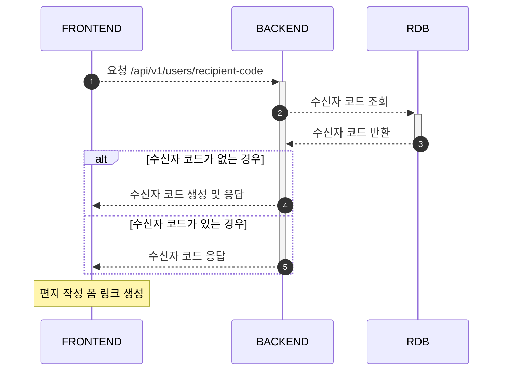
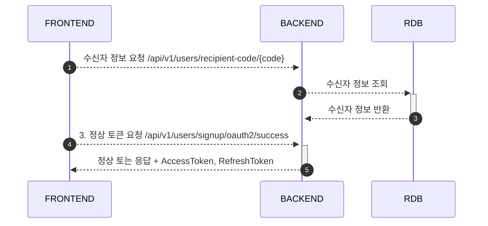
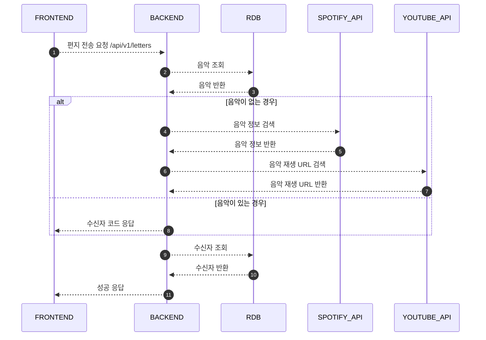

# 편지 전송

## 1. 수신자 코드 생성

```mermaid 
sequenceDiagram
    autonumber
    participant FRONTEND
    participant BACKEND
    participant RDB
    FRONTEND -->> + BACKEND: 요청 /api/v1/users/recipient-code
    BACKEND -->> + RDB: 수신자 코드 조회
    RDB -->> - BACKEND: 수신자 코드 반환
    alt 수신자 코드가 없는 경우
        BACKEND -->> FRONTEND: 수신자 코드 생성 및 응답
    else 수신자 코드가 있는 경우
        BACKEND -->> - FRONTEND: 수신자 코드 응답
    end
    Note over FRONTEND: 편지 작성 폼 링크 생성

```

## 2. 수신자 정보 조회

- **수신자 코드 생성 시 반환받은 코드를 Path에 포함

```mermaid 
sequenceDiagram
    autonumber
    participant FRONTEND
    participant BACKEND
    FRONTEND -->> + BACKEND: 수신자 정보 요청 /api/v1/users/recipient-code/{code}
    BACKEND -->> + RDB: 수신자 정보 조회
    RDB -->> - BACKEND: 수신자 정보 반환
    FRONTEND -->> + BACKEND: 3. 정상 토큰 요청 /api/v1/users/signup/oauth2/success
    BACKEND -->> - FRONTEND: 정상 토는 응답 + AccessToken, RefreshToken

```

## 3. 편지 전송

- **수신자 코드 생성 시 반환받은 코드를 Body에 포함

```mermaid 
sequenceDiagram
    autonumber
    participant FRONTEND
    participant BACKEND
    FRONTEND -->> + BACKEND: 편지 전송 요청 /api/v1/letters
    BACKEND -->> RDB: 음악 조회
    RDB -->> BACKEND: 음악 반환

    alt 음악이 없는 경우
        BACKEND -->> SPOTIFY_API: 음악 정보 검색
        SPOTIFY_API -->> BACKEND: 음악 정보 반환
        BACKEND -->> YOUTUBE_API: 음악 재생 URL 검색
        YOUTUBE_API -->> BACKEND: 음악 재생 URL 반환

    else 음악이 있는 경우
        BACKEND -->> FRONTEND: 수신자 코드 응답
    end

    BACKEND -->> RDB: 수신자 조회
    RDB -->> BACKEND: 수신자 반환
    BACKEND -->> FRONTEND: 성공 응답


```