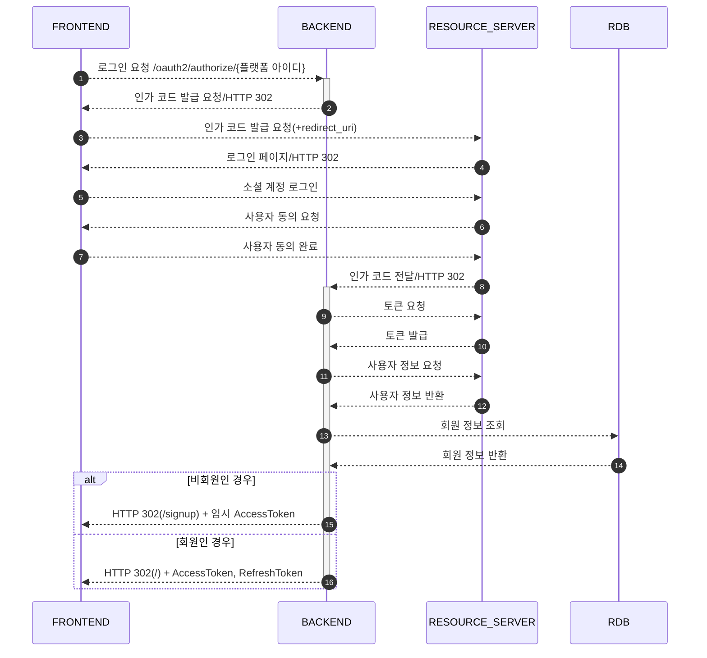
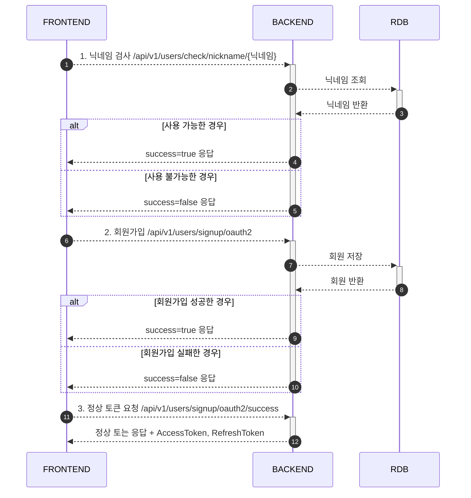

# 소셜 로그인

## 1. 로그인

- 소셜 플랫폼 ID
    - 구글: google
    - 카카오: kakao

- 참고
    - https://developers.kakao.com/docs/latest/ko/kakaologin/rest-api

## 2. 회원가입

- **로그인 요청 시 반환받은 AccessToken을 Header에 포함
- 로그인 요청 시 반환받은 AccessToken은 접근 범위가 제한적
    - 닉네임 검사, 회원가입, 정상 토큰 발급만 접근 가능

