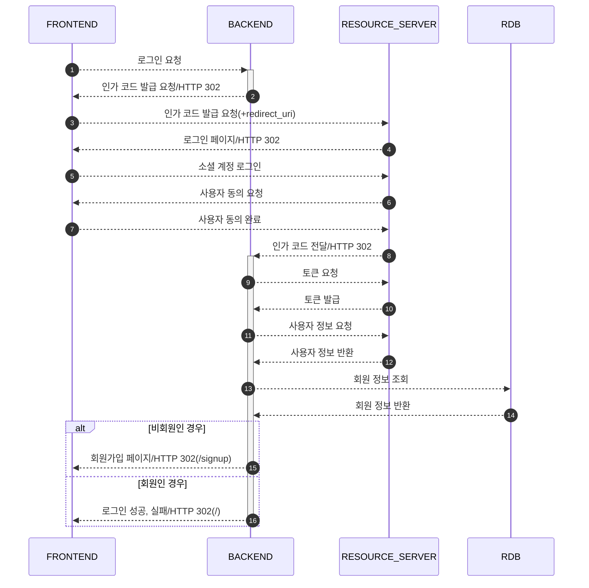

# 소셜 로그인

## 1. 시퀀스다이어그램

### 로그인 요청

#### [GET] /oauth2/authorize/{소셜 플랫폼 ID}

- 소셜 플랫폼 ID
    - 구글: google
    - 카카오: kakao

- 참고
    - https://developers.kakao.com/docs/latest/ko/kakaologin/rest-api
