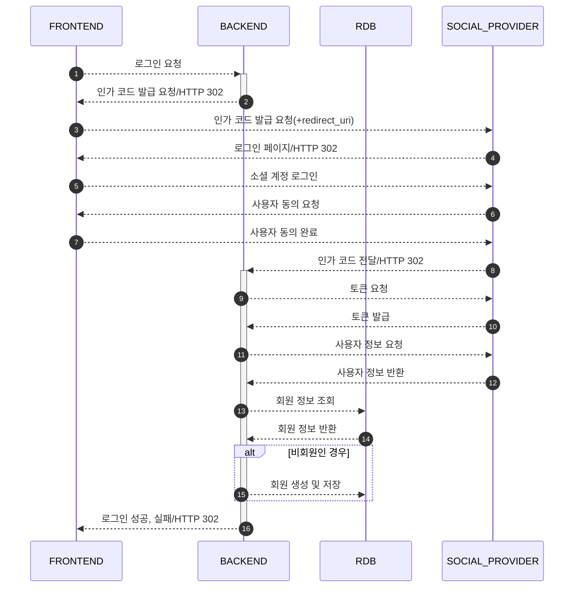

# 소셜 로그인

## 1. 시퀀스다이어그램

```mermaid 
sequenceDiagram
    autonumber
    participant FRONTEND
    participant BACKEND
    participant RDB
    participant SOCIAL_PROVIDER
    FRONTEND -->> + BACKEND: 로그인 요청
    BACKEND -->>  - FRONTEND: 인가 코드 발급 요청/HTTP 302
    FRONTEND -->> SOCIAL_PROVIDER: 인가 코드 발급 요청(+redirect_uri)
    SOCIAL_PROVIDER -->> FRONTEND: 로그인 페이지/HTTP 302
    FRONTEND -->> SOCIAL_PROVIDER: 소셜 계정 로그인
    SOCIAL_PROVIDER -->> FRONTEND: 사용자 동의 요청
    FRONTEND -->> SOCIAL_PROVIDER: 사용자 동의 완료
    SOCIAL_PROVIDER -->> + BACKEND: 인가 코드 전달/HTTP 302
    BACKEND -->> SOCIAL_PROVIDER: 토큰 요청
    SOCIAL_PROVIDER -->> BACKEND: 토큰 발급
    BACKEND -->> SOCIAL_PROVIDER: 사용자 정보 요청
    SOCIAL_PROVIDER -->> BACKEND: 사용자 정보 반환
    BACKEND -->> RDB: 회원 정보 조회
    RDB -->> BACKEND: 회원 정보 반환

    alt 비회원인 경우
        BACKEND -->> RDB: 회원 생성 및 저장
    end
    BACKEND -->>  - FRONTEND: 로그인 성공, 실패/HTTP 302

```

### 로그인 요청

#### [GET] /oauth2/authorize/{소셜 플랫폼}

- 소셜 플랫폼
    - 구글: google
    - 카카오: kakao

- 참고
    - https://developers.kakao.com/docs/latest/ko/kakaologin/rest-api
